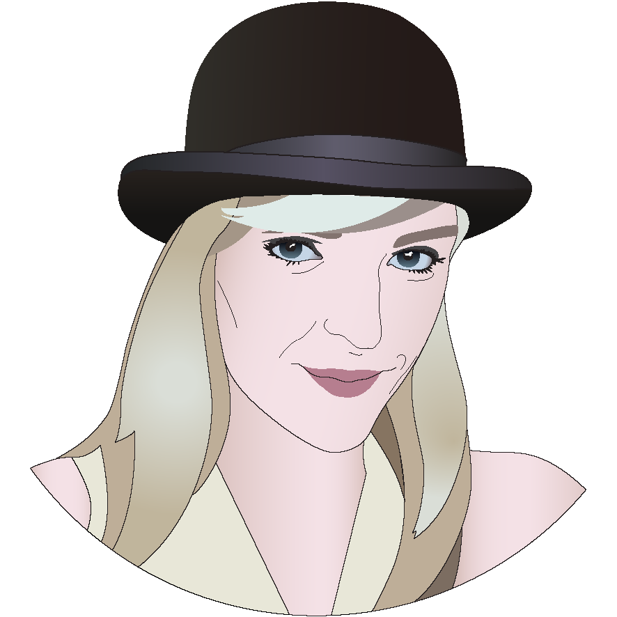

    

        
    

    

        
Julianna Scruggs

        
Austin, TX

        
OccupationDesigner and yogini

        
HobbiesPiano, bead work, drawing, programming and nutrition. 
        

    

    <ul>More About Me
        <li>I grew up on a farm, in Canada.</li> 
        <li>That farm is now home to Blackberry.</li>
        <li>I have a design degree from UT Austin.</li>
        <li>I got a fancy honors title for being top 5% of my class.</li>
        <li>I went to highschool in El Paso.</li>
        <li>I love to grow trees (actual trees).</li>
        <li>My immediate family lives in Las Vegas.</li>
    </ul>

<!-- This is the base Jekyll theme. You can find out more info about customizing your Jekyll theme, as well as basic Jekyll usage documentation at [jekyllrb.com](http://jekyllrb.com/)

You can find the source code for the Jekyll new theme at: [github.com/jglovier/jekyll-new](https://github.com/jglovier/jekyll-new)

You can find the source code for Jekyll at [github.com/jekyll/jekyll](https://github.com/jekyll/jekyll) -->
